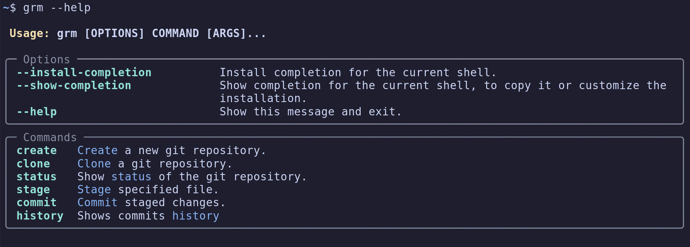

# grm
Git Repo Manager

## Commands


## Installation
Install pipx
```
sudo apt update
sudo apt install pipx
pipx ensurepath
source ~/.bashrc
```
Run in the repo root directory:
```
pipx install .
```
